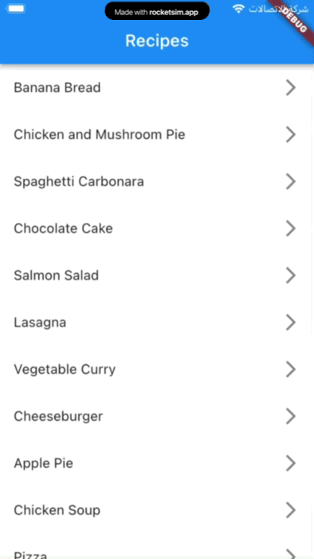

# Developing type-safe routing module for production flutter apps using go_router

Leveraging go_router and type-safe routes for advanced navigation scenarios in Flutter 🚀

- [Developing type-safe routing module for production flutter apps using go\_router](#developing-type-safe-routing-module-for-production-flutter-apps-using-go_router)
  - [Introduction](#introduction)
  - [Prerequisites](#prerequisites)
    - [To follow this article, you will need](#to-follow-this-article-you-will-need)
  - [What we are going to build](#what-we-are-going-to-build)
  - [Setup](#setup)
  - [Basic Navigation](#basic-navigation)
    - [we can see there are two problems with the above code](#we-can-see-there-are-two-problems-with-the-above-code)
  - [Type-safe Routes](#type-safe-routes)
    - [Defining the routes](#defining-the-routes)
  - [Conclusion](#conclusion)

## Introduction

If you’re looking for a way to navigate between screens and handle deep links in your app, you might have heard of go_router. It’s a powerful routing package that supports web, multiple navigators, redirections, and other advanced scenarios. But how do you use it effectively and elegantly? 🤔

In this article, I will share with you how my team and I developed a type-safe routing module with the help of enhanced enums and extension methods. This approach makes our code more maintainable and testable, without relying on code generation. 💯

By the end of this article, you will learn how to:

- Configure your app with go_router. 🛠️
- Define routes and perform basic navigation using go_router. 🚗
- Use enums and extension methods to create typed wrappers for go_router methods. 🎁

Ready to dive in? Let’s get started! 🚀

## Prerequisites

### To follow this article, you will need

- Flutter SDK version 2.8 or higher.
- An IDE of your choice (I use VS Code).
- The go_router package (version 6.4.1 or higher).
- A basic understanding of Flutter widgets and navigation.

## What we are going to build

Our app will let you browse and save simple recipes.

The app has two pages:

1. Recipes Page: This page shows a list of recipes. You can tap on any recipe to see its details.
1. Recipe Details Page: This page shows the ingredients and instructions for the selected recipe. You can also press the add to favorite button to save the recipe and go back to the list. A snack bar will confirm that the recipe was added successfully.

<p align="center"></p>

## Setup

To use go_router in your app, you need to switch to the router constructor on MaterialApp or CupertinoApp and provide it with a Router configuration. Routing packages, such as go_router, typically provide a configuration for you.

First we need to add the go_router as a dependency in the pubspec.yaml

```yaml
go_router: ^6.5.0
```

or you could use the following command in terminal to get the latest version

```bash
flutter pub add go_router 
```

Lets start by defining our router configuration and routes in the `router/app_router.dart` file as follows:

```dart
/// Contains all of the app routes configurations
class AppRouter {
  static final router = GoRouter(
    debugLogDiagnostics: kDebugMode,
    initialLocation: '/recipesList',
    routes: [
      GoRoute(
        name: 'recipesList',
        path: '/recipesList',
        pageBuilder: (context, state) => MaterialPage(
          key: state.pageKey,
          child: const RecipesListPage(),
        ),
      ),
      GoRoute(
        name: 'recipeDetails',
        path: '/recipeDetails',
        pageBuilder: (context, state) {
          final extraMap = state.extra as Map<String, dynamic>;

          final recipe = extraMap['recipe'] as Recipe;
          final favoriteCallback = extraMap['onAddedToFavorite'];

          return MaterialPage(
            key: state.pageKey,
            child: RecipeDetailsPage(
              recipe: recipe,
              onAddedToFavorite: favoriteCallback,
            ),
          );
        },
      ),
    ],
  );
}
```

we have defined two routes `recipesList` and `recipeDetails` and we have also defined the initial route to be `recipesList` which is the recipes list page.

Now we need to use the router in our app, so we need to replace the `MaterialApp` widget with `MaterialApp.router` widget as follows:

```dart
  // This widget is the root of your application.
  @override
  Widget build(BuildContext context) {
    return MaterialApp.router(
      title: 'Type-safe routes Demo',
      theme: ThemeData(
        primarySwatch: Colors.blue,
      ),
      routeInformationParser: AppRouter.router.routeInformationParser,
      routerDelegate: AppRouter.router.routerDelegate,
      routeInformationProvider: AppRouter.router.routeInformationProvider,
    );
  }
```

## Basic Navigation

Now that we have our router configured, we can start using it to navigate between pages. We can use the `GoRouter.of(context)` or the handy `context.pushNamed` method to get the router instance and use it to navigate between pages.

```dart
  void onRecipePressed(BuildContext context, Recipe recipe) {
    context.pushNamed(
      'recipeDetails',
      extra: {
        'recipe': recipe,
        'onAddedToFavorite': (Recipe recipe) {
          ScaffoldMessenger.of(context).showSnackBar(
            SnackBar(
              content: Text(
                'Added ${recipe.name} to favorite',
              ),
            ),
          );
        },
      },
    );
  }
```

we have used the `context.pushNamed` method to navigate to the `recipeDetails` route and we have also passed the recipe object and a callback function to be used when the recipe is added to favorite to pass the selected recipe back to the `recipeList` and display snackbar.

### we can see there are two problems with the above code

1. Using a string as the route name is error-prone, because we can misspell it and the compiler won’t notice it.

   For example, if we write `/recipe-detail` instead of `/recipe-details`, the app will not navigate to the correct page and we won’t know why until we run the app.
2. Passing the recipe object and the callback function as a map in the extra data is risky, because we can provide the wrong data and the compiler won’t warn us.

   For example, if we pass `{'recipe': recipe}` instead of `{'recipe': recipe, 'onAddToFavorite': onAddToFavorite}`, the app will not be able to call the callback function and we won’t know why until we run the app.
3. In a production application with many routes, it would be challenging to locate and modify a specific route or change an action to navigate to a different route without checking the AppRouter class itself.

   For example, if we want to add a new route for editing a recipe, we have to open the app router file and look for all the existing routes to make sure we don’t use a duplicate name or path.

## Type-safe Routes

Now that we have a working basic navigation, we can improve it by using enums and extension methods to make it safer and more convenient to use. This will help us avoid the problems we mentioned earlier and make it easier to move around the app.

### Defining the routes

First we need to define our routes as enum as follows:

```dart
/// Represents the app routes and their paths.
enum AppRoutes {
  recipesList(
    name: 'recipesList',
    path: '/recipesList',
  ),
  recipeDetails(
    name: 'recipeDetails',
    path: '/recipeDetails',
  );

  const AppRoutes({
    required this.name,
    required this.path,
  });

  /// Represents the route name
  ///
  /// Example: `AppRoutes.splash.name`
  /// Returns: 'splash'
  final String name;

  /// Represents the route path
  ///
  /// Example: `AppRoutes.splash.path`
  /// Returns: '/splash'
  final String path;

  @override
  String toString() => name;
}
```

With the help of enhanced enums we can associate the route name and path with the enum value.

Now lets replace the string route names with the enum values in the `AppRouter` class as follows:

```dart
class AppRouter {
  static final router = GoRouter(
    debugLogDiagnostics: kDebugMode,
    initialLocation: AppRoutes.recipesList.path,
    routes: [
      GoRoute(
        name: AppRoutes.recipesList.name,
        path: AppRoutes.recipesList.path,
      ...
      ),
      GoRoute(
        name: AppRoutes.recipeDetails.name,
        path: AppRoutes.recipeDetails.path,
       ...
      ),
    ],
  );
}
```

Now we can use the enum values instead of the string route names in our navigation code in the `RecipesListPage` as follows:

```dart
  void onRecipePressed(BuildContext context, Recipe recipe) {
    context.pushNamed(
      AppRoutes.recipeDetails.name,
      extra: ...
    );
  }
```

We have fixed the first issue, so the compiler will detect any misspelling in the route names or paths. However, we still face the second issue, which is passing the recipe object and the callback function as a map in the extra data. This means that we can provide the wrong data and the compiler won’t warn us.

To solve this problem lets wrap the recipe object and the callback function in a `RecipeDetailsArgs` class as follows:

```dart
class RecipeDetailsArgs {
  RecipeDetailsArgs({
    required this.recipe,
    required this.onAddedToFavorite,
  });

  final Recipe recipe;
  final Function(Recipe) onAddedToFavorite;
}
```

Now lets update the `recipeDetails` route to accept the `RecipeDetailsArgs` class as extra data as follows:

```dart
class AppRouter {
...
      GoRoute(
        name: AppRoutes.recipeDetails.name,
        path: AppRoutes.recipeDetails.path,
        pageBuilder: (context, state) {
          return RecipeDetailsPage(
            args: state.extra as RecipeDetailsArgs,
          );
        },
      ),
...
}
```

Now lets update the `RecipeDetailsPage` to use the `RecipeDetailsArgs` class as parameter as follows:

```dart
class RecipeDetailsPage extends StatelessWidget {
  const RecipeDetailsPage({
    super.key,
    required this.args,
  });

  /// The args used to display the recipe.
  final RecipeDetailsArgs args;

...
}
```

Now lets create new abstract class lets call it `AppNavigator` and define the `pushRecipeDetails` method in it as follows:

```dart
abstract class AppNavigator {
  /// Pushes the [RecipesListPage] to the navigation stack
  void pushRecipeDetails(RecipeDetailsArgs args);
}
```

This class will hold all our navigation methods from now on. We made the `AppNavigator` class abstract to simplify mocking it in our tests or changing the implementation. This way, the pages will not rely directly on the `go_router` package.

Now lets provide an implementation for the `AppNavigator` abstract class as follows:

```dart
class AppNavigatorImpl implements AppNavigator {
  AppNavigatorImpl(this.context);

  final BuildContext context;

  @override
  void pushRecipeDetails(RecipeDetailsArgs args) {
    context.pushNamed(
      AppRoutes.recipeDetails.name,
      extra: args,
    );
  }
}
```

But hold on, how do we access the `AppNavigator` instance from our pages? Fortunately, we can utilize extension methods to enable any widget to access the app navigator.

```dart
extension NavigationHelpersExt on BuildContext {
  AppNavigator get navigator => AppNavigatorImpl(this);
}
```

Now we could access the `AppNavigator` instance from any widget by updating the navigation code in the `RecipesListPage` as follows:

```dart
  void onRecipePressed(BuildContext context, Recipe recipe) {
    context.navigator.pushRecipeDetails(
      RecipeDetailsArgs(
        recipe: recipe,
        onAddedToFavorite: (Recipe recipe) {
          ScaffoldMessenger.of(context).showSnackBar(
            SnackBar(
              content: Text(
                'Added ${recipe.name} to favorite',
              ),
            ),
          );
        },
      ),
    );
  }
```

We have fixed the second and third issue as well. The compiler will detect any misspelling in the arguments. Also, for production projects that have many pages, we can easily see all the defined pages in the app and navigate to them by typing `context.navigator`, without having to check the `AppRouter`.

Another benefit of using this approach is we could extract the whole routing logic to a separate module and share it between different modules.

## Conclusion

To sum up, GoRouter is a great package that makes navigation easier in Flutter apps. 🚗 But it can also cause mess and confusion when we have many pages. 😕 To prevent this, we can leverage enhanced enums and extension methods to make our navigation more reliable and user-friendly. 👍 This way, we can get the best of both worlds: GoRouter’s features and code quality and readability. 🙌

You can find the project’s source code on [Github](https://github.com/Mohanedy98/go-router-example-with-type-safe-routes). Feel free to play around and reach me on [Twitter](https://twitter.com/mohanedy98) if you have any questions, suggestions, or feedback.

I’m so grateful to @A-Fawzyy for his awesome help and advice that made this article better. ❤️

Thanks for reading! ❤️
